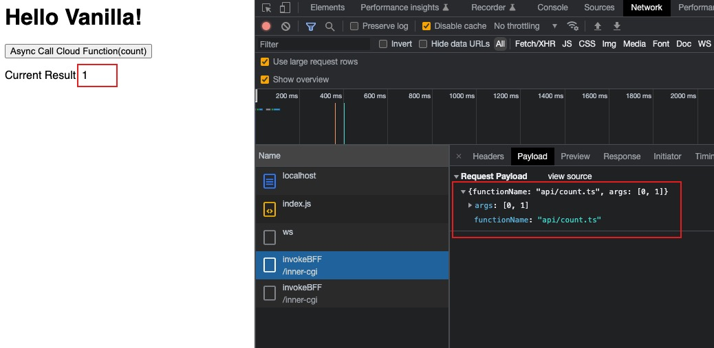

# cloud-function-runtime-demo

## 简介

本项目是一个前后端一体化开发的 DEMO，主要包括以下几个项目：

- [云函数最小运行时项目](./packages/cloud-function-runtime/README.md)：使用 `Node.js` 与 `isolated-vm` 实现了云函数最小运行时环境服务，可以通过接口直接运行云函数
- [前后端一体化开发示例项目](./packages/example/README.md)：通过 `webpack` 与 `rollup` 编译，配合云函数运行时实现了简单的应用级别前后端一体化开发的能力

## 技术栈

- yarn 3.1+
- Typescript
- Node.js
- isolated-vm
- webpack
- rollup

## 快速开始

```bash
# 初始化包管理器, 会自动安装 yarn, pnpm 等工具到全局
npm i -g corepack

# 初始化并安装项目
yarn

# 启动云函数运行时服务
yarn run start

# 启动前后端一体化开发示例服务端编译
yarn run start:example-server

# 启动前后端一体化开发示例前端编译
yarn run start:example-static
```

执行完上述命令后会自动打开网页应用

## 前后端一体化开发使用展示

### 1. 示例项目介绍

点击按钮时会发起云函数请求 `api/count`，返回的结果会展示在页面上



### 2. 示例核心代码

#### 项目结构

```txt
packages/example/src/

├── api
│   ├── add.ts
│   └── count.ts
├── index.css
├── index.ts
```

#### 后端逻辑编写方式

可以看到后端云函数的编写方式与一般的函数编写方式基本没有不同，目前只有以下特殊要求：

1. 只能编写异步函数
2. 目前只支持 `export default` 导出，即一个文件为一个云函数
3. 入参与出参都可以序列化成字符串

```js
// src/api/count
import add from "./add";

export default async (...args: number[]) => {
  return args.reduce((prev, current) => prev + current, 0);
};
```

#### 前端逻辑编写方式

前端根据 `@api/*` 别名直接引入云函数，直接使用即可

```js
// src/index.ts
// 1. 使用别名引入对应的云函数
import count from "@api/count";

import "./index.css";

const init = async () => {
  document.getElementById("app")!.innerHTML = `
  <h1>Hello Vanilla!</h1>
  <button id="count">Async Call Cloud Function(count)</button>
  <p id="result">Current Result: 0</p>
  `;
  let currentCount = 0;

  const refreshUI = () => {
    document.getElementById(
      "result"
    )!.innerText = `Current Result: ${currentCount}`;
  };

  const addEventListener = () => {
    document.getElementById("count")!.onclick = async () => {
      // 2. 这里可以直接进行调用
      currentCount = await count(currentCount, 1);
      refreshUI();
    };
  };

  addEventListener();
  refreshUI();
};

init();
```
